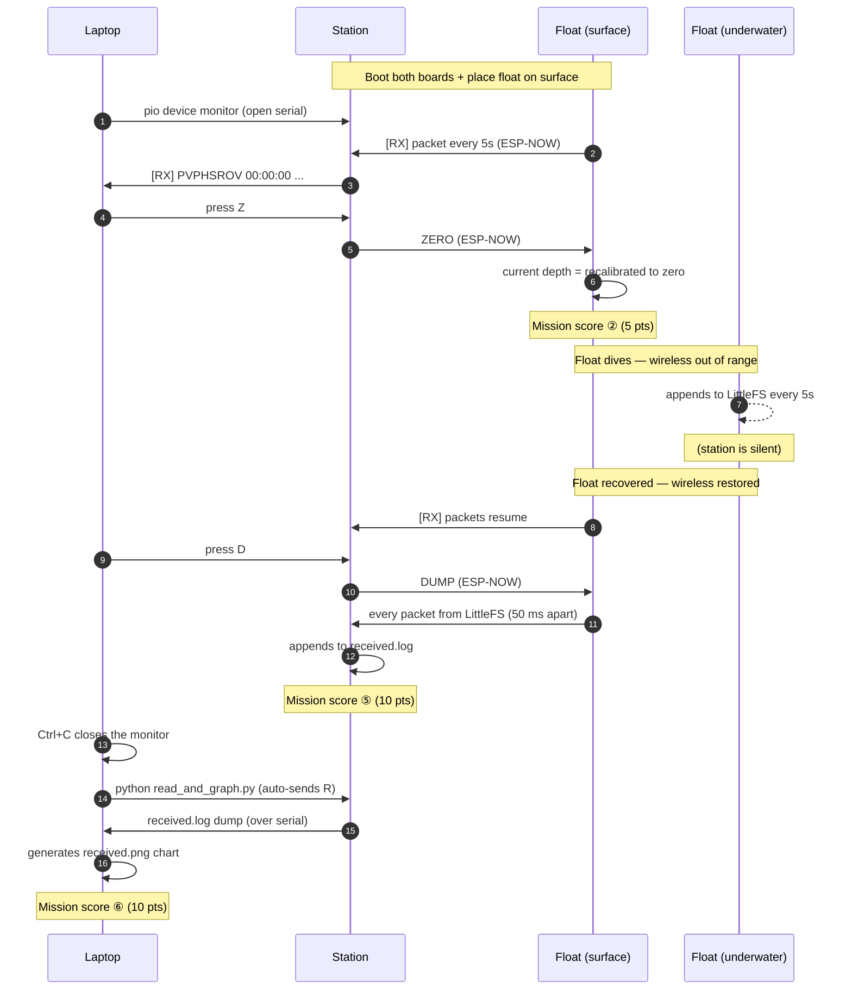

# ESP32-S3 N16R8 — MATE Floats 2026

Autonomous float firmware running on two ESP32-S3 DevKitC-1 N16R8 boards. Built for the **MATE ROV 2026 "Floats Under the Ice"** mission. See [`docs/2026_MATE_Floats_분석.md`](docs/2026_MATE_Floats_분석.md) for full mission details.

- **MCU**: ESP32-S3 N16R8 (16 MB Flash + 8 MB Octal PSRAM)
- **Framework**: Arduino (PlatformIO)
- **Wireless**: ESP-NOW bidirectional unicast (MAC whitelist prevents cross-team interference at competition)
- **Sensor**: BlueRobotics MS5837-30BA (I2C 0x76, SDA=GPIO8, SCL=GPIO9)

## Two boards / two firmwares

| Directory  | Role                                                                          | Dependencies |
| ---------- | ----------------------------------------------------------------------------- | ------------ |
| `float/`   | Float board. Depth sensing + packet TX + LittleFS logging + wireless RX       | MS5837       |
| `station/` | Ground station board. Packet RX + key-input command TX                        | none         |

## USB ports

The DevKitC-1 has two USB-C ports.

- **First firmware upload**: use the `UART` side (auto-reset works 100% of the time)
- **Day-to-day use afterward**: use the `USB` side (auto-reset works as long as the firmware is alive, and `Serial` output is routed here)

For the full set of pitfalls and troubleshooting tips, see the "USB ports — there are two" section in [`CLAUDE.md`](CLAUDE.md).

## Build / upload / monitor

> **First time?** See [`docs/prerequisites.md`](docs/prerequisites.md) for installation steps (macOS / Windows, developer / demo scenarios). One-time setup is `cd tools && uv sync`.

Activate the `tools/` virtual environment once per terminal, then `pio` works directly:

```bash
cd tools && source .venv/bin/activate    # macOS / Linux
# Windows (PowerShell): cd tools; .venv\Scripts\Activate.ps1
```

After activation:

```bash
# Float board
pio run -d ../float -t upload -t monitor

# Ground station board
pio run -d ../station -t upload -t monitor
```

| Command                              | Purpose               |
| ------------------------------------ | --------------------- |
| `pio run -d ../<board>`              | Build only            |
| `pio run -d ../<board> -t upload`    | Build + upload        |
| `pio device monitor --baud 115200`   | Serial monitor only   |
| `pio run -d ../<board> -t clean`     | Clean build artifacts |
| `pio device list`                    | List connected ports  |

## Wireless command reference

While the float is on the surface or just after recovery, send commands to the float by **typing keys into the serial monitor connected to the station** (the Python tool below is recommended). The station firmware turns each single character into a 4-byte ESP-NOW command and forwards it.

**Wireless commands (station → float, ESP-NOW):**

| Key | Command sent    | Float behavior                                                                | Response (station serial)      |
| --- | --------------- | ----------------------------------------------------------------------------- | ------------------------------ |
| `D` | `DUMP`          | Wirelessly transmits the entire LittleFS mission log line by line (50 ms gap) | `[RX] PVPHSROV ...` × N        |
| `Z` | `ZERO`          | Recalibrates depth zero (16-sample average) + resets mission timer            | `[RX] ZERO_OK offset=X.XXXX m` |
| `P` | `PING`          | Connection check reply                                                        | `[RX] PONG`                    |
| `S` | `STAR` (=START) | Triggers the autonomous sequence (currently a stub)                           | `[RX] START_STUB`              |

**Local commands (handled by the station itself):**

| Key | Action                       | Notes                              |
| --- | ---------------------------- | ---------------------------------- |
| `R` | Dumps `received.log` over serial | Sent automatically by the Python tool |
| `E` | Deletes `received.log`           | Cleanup before a new mission       |
| `I` | Prints file / FS usage           | —                                  |
| `H` | Re-prints the help message       | —                                  |

The float side automatically ignores commands from other teams via a station MAC whitelist check. The receive callback only sets a flag; heavy work (recalibration, dump) runs in `loop()` to keep ISR safety.

### Typical mission flow (during a run)

Three actors — **Laptop**, **Station** (ground board), and **Float** (submerging board) — cooperate in time order.



**Step-by-step summary:**

| #   | Actor             | Action                                                                                            | Score    |
| --- | ----------------- | ------------------------------------------------------------------------------------------------- | -------- |
| 1   | Station + Float   | Boot both boards (USB / battery)                                                                  | —        |
| 2   | Laptop            | Open the station serial via `pio device monitor`                                                  | —        |
| 3   | Operator          | Place the float on the water (surface)                                                            | —        |
| 4   | Laptop            | `Z` → station → ZERO command to float (zero-point calibration at the surface)                     | ② 5 pts  |
| 5   | Operator          | Float dives → runs the mission (2.5 m depth / 40 cm profile)                                      | —        |
| 6   | Float             | No wireless reach → appends only to its own LittleFS every 5 s                                    | —        |
| 7   | Operator          | Float recovered (back to surface) → wireless restored                                             | —        |
| 8   | Laptop            | `D` → station → DUMP command to float → station saves every packet to its LittleFS               | ⑤ 10 pts |
| 9   | Laptop            | Close monitor → `python read_and_graph.py` → produces `received.png` chart                        | ⑥ 10 pts |

**Key-input responsibilities:**

- `D` `Z` `P` `S` = the station receives them and forwards via ESP-NOW to the float
- `R` `E` `I` = handled locally by the station (LittleFS dump / erase / info). Either typed by the operator or sent automatically by the Python tool.

## Data reading + graphing tool (`tools/`)

```bash
cd tools && source .venv/bin/activate    # one-time per terminal

# No options needed — auto-detects the single attached station, sends R, produces received.log + received.png
python read_and_graph.py
```

Behavior:

- Auto-detects the ESP32-S3 USB port (VID=0x303A)
- Sends a single `R` byte → the station's `received.log` flows out over serial
- Saves every line to `received.log` (current directory)
- Stops automatically when it sees the `---- END received.log ----` marker
- Parses the packets and produces `received.png` (depth-vs-time chart, Y-axis inverted)

**Caution**: The station serial port can only be held by one process at a time. If `pio device monitor` is already running, it will conflict with this tool, so close it first (`pkill -f "pio.*monitor"`).

## Directory structure

```text
.
├── float/
│   ├── platformio.ini      # Board + MS5837 library
│   └── src/main.cpp        # Depth · packets · LittleFS · wireless TX/RX
├── station/
│   ├── platformio.ini      # Board (no libraries)
│   └── src/main.cpp        # RX + key input → command TX
├── tools/
│   ├── pyproject.toml      # uv project (platformio, pyserial, matplotlib)
│   ├── uv.lock
│   └── read_and_graph.py
├── docs/
│   ├── prerequisites.md
│   └── 2026_MATE_Floats_분석.md
├── examples/               # Older learning-stage code (LED, button, toggle)
├── CLAUDE.md               # Dev guide (board setup, pitfalls, troubleshooting)
├── TODO.md                 # Mission backlog + completion log
└── README.md
```

## References

- [Prerequisites](docs/prerequisites.md) — Install instructions for macOS / Windows, developer / competition-day setups
- [Mission analysis](docs/2026_MATE_Floats_분석.md) — Scoring / packet format / physical & electrical constraints
- [TODO](TODO.md) — Mission backlog + completed decisions
- [CLAUDE.md](CLAUDE.md) — Dev environment / pitfalls / troubleshooting
- [ESP32-S3 DevKitC-1 official documentation](https://docs.espressif.com/projects/esp-idf/en/latest/esp32s3/hw-reference/esp32s3/user-guide-devkitc-1.html)
- [Arduino-ESP32 API reference](https://docs.espressif.com/projects/arduino-esp32/en/latest/)
