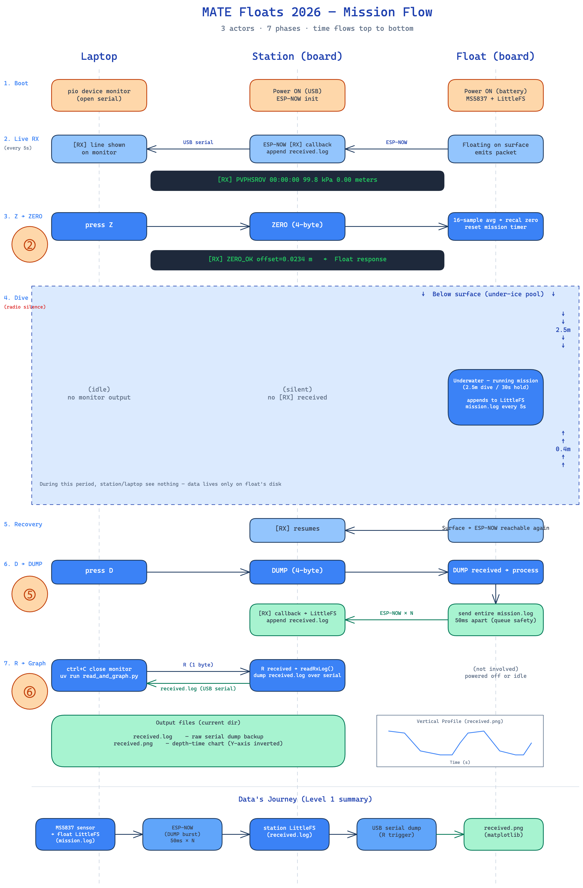

# ESP32-S3 N16R8 — MATE Floats 2026

ESP32-S3 DevKitC-1 N16R8 두 대로 구성된 자율 플로트 펌웨어. **MATE ROV 2026 "Floats Under the Ice"** 미션 출전용. 미션 상세는 [`docs/2026_MATE_Floats_분석.md`](docs/2026_MATE_Floats_분석.md).

- **MCU**: ESP32-S3 N16R8 (Flash 16 MB + Octal PSRAM 8 MB)
- **프레임워크**: Arduino (PlatformIO)
- **무선**: ESP-NOW 양방향 unicast (MAC 화이트리스트로 대회 충돌 방지)
- **센서**: BlueRobotics MS5837-30BA (I2C 0x76, SDA=GPIO8, SCL=GPIO9)

> **처음 셋업하시나요?** [`docs/prerequisites_ko.md`](docs/prerequisites_ko.md) — uv 설치 + `tools/` 가상환경 동기화 + 두 터미널 미션 흐름까지 안내.

## 두 보드

| 디렉토리   | 역할                                                                |
| ---------- | ------------------------------------------------------------------- |
| `float/`   | 플로트 보드. 깊이 측정 + 패킷 송신 + LittleFS 로깅 + 무선 명령 수신 |
| `station/` | 지상국 보드. 패킷 수신 + 키 입력으로 명령 송신                      |

## USB 연결

DevKitC-1 의 두 USB-C 포트 중 **`USB` 라벨** 쪽에 station 케이블을 꽂으세요 (`UART` 쪽 아님). 모니터로 보는 `Serial` 출력은 `USB` 포트로만 라우팅됩니다.

자세한 함정·트러블슈팅은 [`CLAUDE.md`](CLAUDE.md) 의 "USB 포트가 두 개" 섹션 참고.

## 무선 명령어 사용법

플로트가 물에 떠 있거나 회수된 직후, **station 시리얼 모니터에 키 입력** 으로 float 에 명령을 보냅니다 (모니터는 활성화된 `tools/` venv 안에서 `pio device monitor` 로 열기 — prerequisites 참고). station 펌웨어가 단일 문자를 받아 ESP-NOW 4-byte 명령으로 변환·전달.

**무선 명령 (station → float, ESP-NOW):**

| 키  | 송신 명령       | float 동작                                                                                                              | 응답 (station 시리얼)        |
| --- | --------------- | ----------------------------------------------------------------------------------------------------------------------- | ---------------------------- |
| `S` | `STAR` (=START) | 자율 미션 실행: 3회 수직 프로파일 (하강 → 2.5m hold 30초 → 40cm hold 30초) × 3                                          | `[RX] MISSION_START` + 상태 로그 |
| `X` | `ABRT` (=ABORT) | 모든 동작 정지 (모터 OFF, 램프 테스트 OFF, 미션 상태 IDLE 복귀)                                                        | `[RX] ABORTED`               |
| `T` | `TEST`          | 10초 모터 속도 램프 self-test (0 → 255 → 0, 흡입 방향). ENB PWM 배선 검증.                                              | `[RX] TEST_START`            |
| `C` | `CALI`          | 수중 HOLD-PWM 자동 캘리브레이션: 2.27m 이상 하강 후 PWM 60-180 7단계 × 4초 sweep, 가장 드리프트 작은 값을 `/cali.txt`에 저장. 부팅 시 자동 로드. (생략 시 미션 첫 HOLD_DEEP에서 4단계 inline sweep 자동 실행.) | `[RX] CALI_OK pwm=N`         |
| `P` | `PING`          | 연결 확인 회신                                                                                                          | `[RX] PONG`                  |
| `D` | `DUMP`          | LittleFS 미션 로그 전체를 한 줄씩 무선 송신 (50 ms 간격)                                                                | `[RX] PVPHSROV ...` × N개    |

**로컬 명령 (station 자체 처리):**

| 키  | 동작                       | 비고                    |
| --- | -------------------------- | ----------------------- |
| `R` | `received.log` 시리얼 dump | Python 도구가 자동 송신 |
| `E` | `received.log` 삭제        | 새 미션 전 정리         |
| `I` | 파일/FS 사용량 출력        | —                       |
| `H` | 도움말 다시 출력           | —                       |

## 미션 흐름

세 행위자 — **Laptop**, **Station** (지상국 보드), **Float** (잠수 보드) — 가 시간 순으로 협력합니다.



**단계별 요약:**

| #   | 행위자          | 동작                                                                         | 점수   |
| --- | --------------- | ---------------------------------------------------------------------------- | ------ |
| 1   | Station + Float | 두 보드 부팅 (USB / 배터리). 부팅 직후 float이 5초마다 패킷 자동 송신 시작.       | —      |
| 2   | Laptop          | station 시리얼 모니터 열기 (터미널 1) — 패킷 수신 확인.                            | —      |
| 3   | 사람            | float을 물에 띄움 (수면). 첫 프로파일 시작 전 패킷이 station에 한 번 이상 도달해야 함. | ② 5점  |
| 4   | Laptop          | `S` 키 → station → STAR 명령 → float이 3회 수직 프로파일 자율 수행                 | ③④ 50점 |
| 5   | Float           | 잠수 중 무선 도달 불가 → 자기 LittleFS 에만 5초마다 누적                          | —      |
| 6   | 사람            | float이 프로파일 사이/마지막에 수면 도달 → 무선 복구                              | —      |
| 7   | Laptop          | `D` 키 → station → DUMP 명령 → station LittleFS 에 모든 패킷 저장                  | ⑤ 10점 |
| 8   | Laptop          | 터미널 2 에서: `python read_and_graph.py` → `received.png` 그래프 생성             | ⑥ 10점 |

**키 입력 분담:**

- `S` `X` `T` `C` `P` `D` = station 이 받아서 ESP-NOW 로 float 에 전달
- `R` `E` `I` = station 로컬 (LittleFS dump/erase/info). 사람이 직접 누르거나 Python 이 자동 송신

정확한 두 터미널 명령 (모니터 + 그래프) 은 [`docs/prerequisites_ko.md`](docs/prerequisites_ko.md) 참고.

## 디렉토리 구조

```text
float/
├── platformio.ini
└── src/main.cpp        # 깊이·패킷·LittleFS·무선 송수신

station/
├── platformio.ini
└── src/main.cpp        # 수신 + 키 입력 → 명령 송신

tools/
├── pyproject.toml      # uv 프로젝트 (platformio, pyserial, matplotlib)
├── uv.lock
└── read_and_graph.py

docs/
├── prerequisites_ko.md
├── Floats.png
└── 2026_MATE_Floats_분석.md
```

## 참고 문서

- [사전 요구사항](docs/prerequisites_ko.md) — 설치 + 두 터미널 미션 흐름 (macOS / Windows)
- [미션 분석](docs/2026_MATE_Floats_분석.md) — 점수표 / 패킷 형식 / 물리·전기 제약
- [TODO](TODO.md) — 미션 진행 항목 + 완료된 결정사항
- [CLAUDE.md](CLAUDE.md) — 개발 환경 / 함정 / 트러블슈팅
- [ESP32-S3 DevKitC-1 공식 문서](https://docs.espressif.com/projects/esp-idf/en/latest/esp32s3/hw-reference/esp32s3/user-guide-devkitc-1.html)
- [Arduino-ESP32 API 레퍼런스](https://docs.espressif.com/projects/arduino-esp32/en/latest/)
